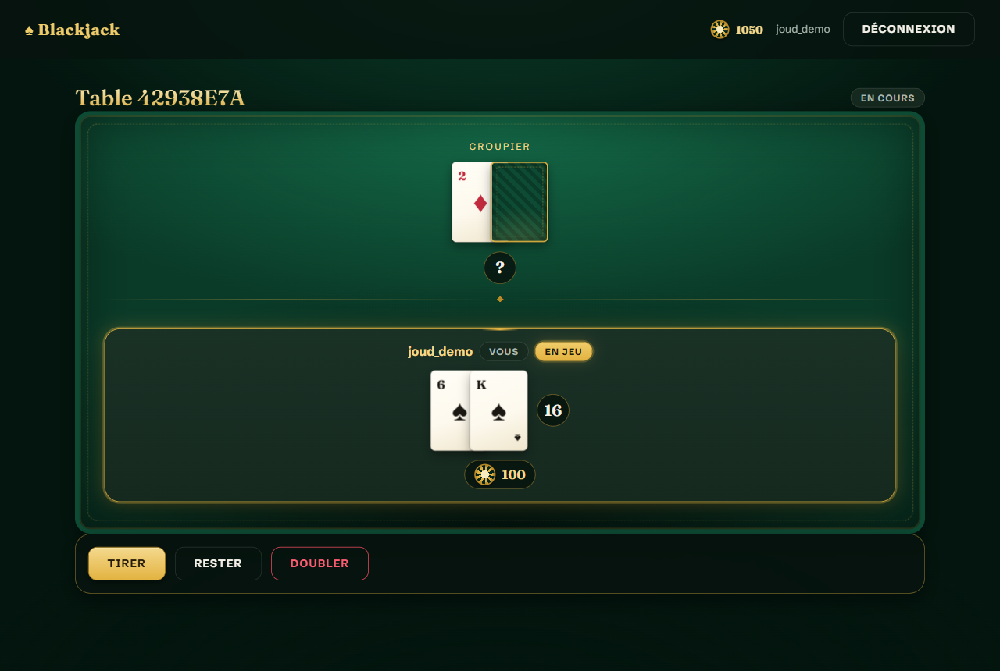
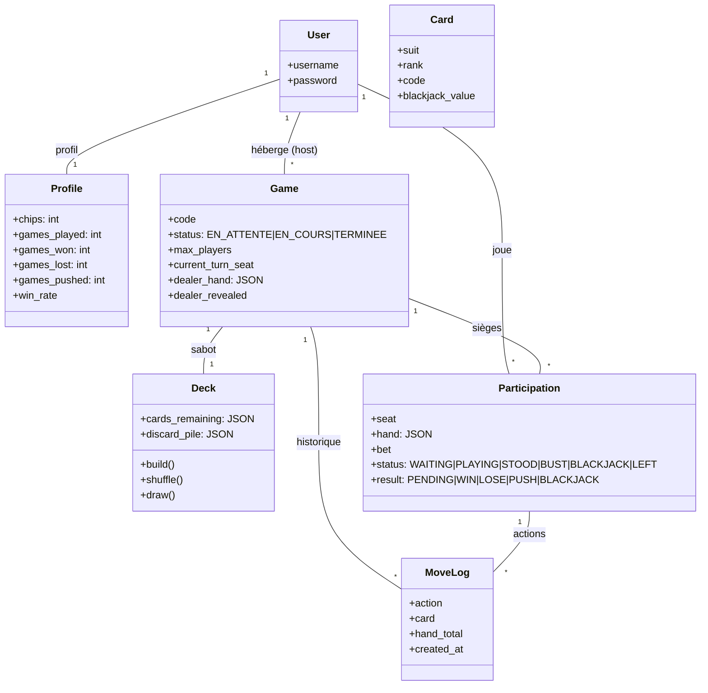
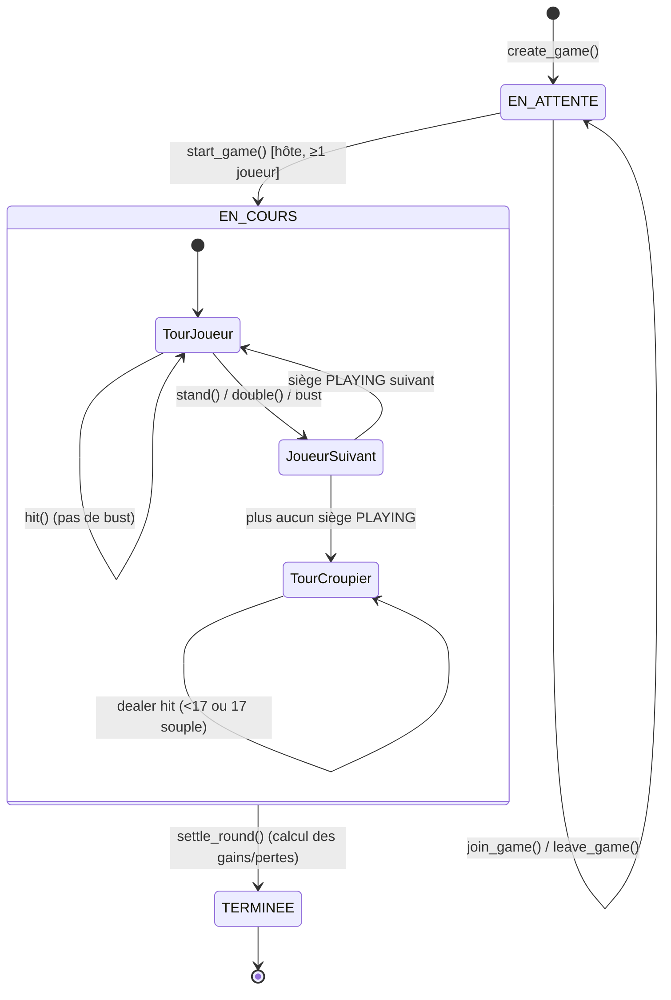

# 🃏 Blackjack — Plateforme de Jeu de Cartes Web

**Auteurs :** Amine Kaoutar, Walid HDILOU, Joud ATALLAH
**Jeu retenu :** Blackjack (21) — un ou plusieurs joueurs contre le croupier, dans la tradition des tables de casino.



---

## Sommaire

- [Règles du jeu](#règles-du-jeu)
- [Démarrage rapide](#démarrage-rapide)
- [Architecture logicielle](#architecture-logicielle)
- [Choix UI/UX & Design Tokens](#choix-uiux--design-tokens)
- [Qualité, tests & CI](#qualité-tests--ci)
- [Journal d'architecture & auto-évaluation](#journal-darchitecture--auto-évaluation)

---

## Règles du jeu

Chaque table (`Game`) oppose un à plusieurs joueurs (sièges/`Participation`) au croupier, contrôlé par le serveur :

1. **Mise** : chaque joueur mise des jetons en rejoignant la table (débités immédiatement).
2. **Distribution** : à l'ouverture de la partie, deux cartes sont distribuées à chaque joueur et au croupier (une carte du croupier reste cachée).
3. **Tours** : chaque joueur, à son tour, peut **Tirer** (`hit`), **Rester** (`stand`) ou **Doubler** (`double`, uniquement au premier coup, mise doublée contre une carte supplémentaire).
4. **Dépassement** : au-delà de 21 points, le joueur est éliminé (`BUST`) et perd sa mise.
5. **Croupier** : une fois tous les joueurs passés, le croupier révèle sa main et tire jusqu'à atteindre 17 (il tire aussi sur un 17 "souple", c'est-à-dire un As compté 11).
6. **Score** : les As valent 11 ou 1 (le plus favorable), les figures valent 10. Un Blackjack naturel (As + figure/10 au tirage initial) paie 3 pour 2 ; une victoire simple paie 1 pour 1 ; une égalité (*push*) rembourse la mise.

## Démarrage rapide

### Prérequis

- [Docker](https://docs.docker.com/get-docker/) et le plugin `docker compose`.

### Lancer l'infrastructure complète

```bash
git clone <url-du-dépôt>
cd new-agent-Air-LLm
cp .env.example .env        # puis éditez SECRET_KEY / POSTGRES_PASSWORD
docker compose up --build
```

Cette unique commande construit l'image Django, puis démarre trois services : `web` (Django + Gunicorn), `db` (PostgreSQL) et `cache` (Redis). Le conteneur `web` attend que `db` et `cache` soient déclarés **healthy** (healthchecks Compose) avant de démarrer, applique les migrations automatiquement (`entrypoint.sh`), puis sert l'application sur **http://localhost:8000**.

### Créer un compte administrateur

Dans un second terminal, pendant que la stack tourne :

```bash
docker compose exec web python manage.py createsuperuser
```

L'interface d'administration est disponible sur `http://localhost:8000/admin/`.

### Développement local sans Docker (optionnel)

```bash
uv sync
uv run python manage.py migrate
uv run python manage.py runserver
```

Sans les variables `POSTGRES_*` / `REDIS_URL`, l'application retombe automatiquement sur SQLite et le cache mémoire local — pratique pour itérer rapidement.

## Architecture logicielle

### Diagramme de classes (modèles ORM)



`Card` sert de catalogue de référence des 52 cartes (semé via une migration de données) ; `Deck` et `Participation` manipulent des **codes de cartes** compacts (`"AS"`, `"10H"`…) dans des champs `JSONField`, ce qui rend `draw()`/`shuffle()` bon marché sans aller-retour base de données par carte.

### Machine à états (déroulement d'une partie)



Chaque `Game` représente **une manche complète** : distribution → tours → fin de partie → calcul du score, exactement le cycle EN_ATTENTE → EN_COURS → TERMINEE. Pour rejouer, les joueurs créent (ou rejoignent) une nouvelle table.

### Isolation du moteur de jeu (SRP)

- `blackjack/game_engine.py` contient **toute** la logique métier (score des mains, tours, validation des coups, IA du croupier, règlement des mises) sous forme de fonctions pures manipulant des instances de modèles. Il ne connaît ni Django `HttpRequest`, ni templates.
- `blackjack/views.py` ne fait que : authentifier, verrouiller la ligne `Game` (`select_for_update` dans une transaction) pour éviter les conditions de course entre joueurs simultanés, appeler le moteur, et sérialiser la réponse.
- `blackjack/serializers.py` traduit l'état des modèles en JSON partagé entre le rendu serveur (templates) et les endpoints AJAX/fetch, pour que les deux restent toujours cohérents.
- Toute tentative illégale (jouer hors tour, doubler après le premier coup, démarrer sans être l'hôte…) lève `IllegalMoveError`, intercepté par les vues et retourné en HTTP 400 — **impossible de tricher en modifiant la requête client**, la règle est vérifiée côté serveur à chaque appel.

### Sécurité

- Vues protégées par `@login_required` ; actions de jeu en `POST` uniquement (`@require_POST`).
- Jeton CSRF Django sur tous les formulaires et transmis en en-tête `X-CSRFToken` pour les appels `fetch`.
- Sessions Django stockées dans Redis (`SESSION_ENGINE` = cache) en production.
- `SECRET_KEY`, mots de passe PostgreSQL, etc. injectés uniquement via variables d'environnement (`.env`, jamais commité — voir `.env.example`).

## Choix UI/UX & Design Tokens

### Design tokens (`blackjack/static/blackjack/css/tokens.css`)

Toutes les valeurs visuelles sont centralisées en variables CSS, consommées par le reste des feuilles de style — aucune couleur ni espacement codé en dur ailleurs :

- **Couleurs des enseignes** : `--suit-hearts`/`--suit-diamonds` (rouge) vs `--suit-clubs`/`--suit-spades` (noir), plus une palette de table (`--color-felt-*`, `--color-gold-*`) évoquant un tapis de casino.
- **Espacements** : échelle `--space-1` (4px) à `--space-8` (64px).
- **Typographies** : `--font-display` (serif, titres/cartes) et `--font-body` (sans-serif, UI), échelle `--text-xs` à `--text-2xl`.
- **Rayons, ombres, transitions** pour une cohérence visuelle globale.

### Hiérarchie Atomic Design

| Niveau | Fichier | Composants |
| --- | --- | --- |
| Atomes | `atoms.css` | `.card-unit` (carte individuelle, face visible/cachée), `.badge` (statut, tour actif), `.btn`, `.chip` (jetons) |
| Molécules | `molecules.css` | `.player-hand` (main + total), `.deck-stack` (pioche), `.action-zone` (Tirer/Rester/Doubler), `.seat` (siège complet d'un joueur) |
| Organismes | `organisms.css` | `.game-table` (tapis réactif complet), `.scoreboard` (tableau des scores/statistiques), `.game-list` (lobby), `.navbar` |

### Retours visuels

- Chaque carte distribuée s'anime à l'apparition (`@keyframes card-deal`, translation + fondu).
- Le siège du joueur dont c'est le tour reçoit `.seat--active-turn` (halo doré) ; le vôtre reçoit `.seat--you`.
- Les badges de résultat changent de couleur selon l'issue (`--win`/`--lose`/`--push`/`--bust`/`--active`).
- `blackjack/static/blackjack/js/table.js` utilise `fetch()` pour jouer un coup sans rechargement de page (les boutons Tirer/Rester/Doubler appellent l'endpoint `/games/<code>/action/` en JSON) et interroge périodiquement l'état de la table (`/games/<code>/state/`) pour synchroniser les coups des autres joueurs.

## Qualité, tests & CI

- **Tests unitaires** (`blackjack/tests.py`) : calcul de la main (As haut/bas, plusieurs As), détection de bust/blackjack, `Deck.build()`/`draw()`/reshuffle du sabot.
- **Tests d'intégration** : cycle de vie complet d'une table (rejoindre, quitter, démarrer, permissions hôte), règlement déterministe des manches (victoire, défaite, égalité, bust, doublage), traçabilité via `MoveLog`, permissions des vues (connexion requise, 400 JSON sur coup illégal, 404 sur table inconnue).
- 32 tests, exécutables via :
  ```bash
  uv run python manage.py test
  ```
- **Linting/formatage** : [`ruff`](https://docs.astral.sh/ruff/) (règles E/F/I/UP/B) et [`black`](https://black.readthedocs.io/) (ligne 100), configurés dans `pyproject.toml`.
  ```bash
  uv run ruff check .
  uv run black --check .
  ```
- **CI** (`.github/workflows/ci.yml`) : à chaque `push`/`pull_request`, GitHub Actions démarre un service PostgreSQL, installe les dépendances via `uv`, exécute `ruff`, `black --check`, puis la suite de tests Django — reproduisant fidèlement l'environnement de `docker compose`.

## Journal d'architecture & auto-évaluation

**Une `Game` = une manche.** La grille de notation décrit un cycle `EN_ATTENTE → EN_COURS → TERMINEE` correspondant précisément à distribution → tours → fin de partie → score. Plutôt que de faire d'une table un objet persistant multi-manches (ce qui aurait ajouté un état intermédiaire "entre deux manches" non demandé), chaque `Game` représente une manche complète ; rejouer signifie créer/rejoindre une nouvelle table. Ce choix a simplifié le moteur de jeu et collé exactement à la machine à états attendue.

**Cartes en JSON plutôt qu'en lignes FK.** Modéliser chaque carte piochée comme une ligne `Card` liée par clé étrangère aurait multiplié les requêtes SQL pour une opération aussi triviale que "piocher une carte". Le compromis retenu conserve `Card` comme catalogue ORM des 52 cartes (satisfaisant l'exigence de modélisation), tandis que `Deck.cards_remaining` et `Participation.hand` stockent des codes compacts (`"AS"`, `"10H"`) en `JSONField` — `draw()`/`shuffle()` restent des opérations en mémoire, bon marché même à plusieurs joueurs simultanés.

**Concurrence multi-joueurs.** Plusieurs joueurs peuvent agir sur la même table : les vues verrouillent la ligne `Game` (`select_for_update()` dans une transaction) avant d'appeler le moteur, pour qu'un `hit` et un `stand` concurrents sur deux sièges différents ne corrompent jamais l'ordre des tours ni le sabot partagé.

**Python 3.12 plutôt que 3.11.** Le sujet suggère `python:3.11-slim`, mais Django 6.0 exige Python ≥ 3.12. L'image `python:3.12-slim` a été retenue pour rester sur la dernière version stable de Django tout en conservant un footprint "slim" équivalent — documenté ici pour que ce choix ne surprenne pas à la correction.

**Difficulté principale : le state machine du tour.** Gérer "à qui le tour, et que se passe-t-il quand tout le monde a fini" en gardant le moteur sans effet de bord caché a demandé plusieurs itérations. La solution retenue centralise cette logique dans une unique fonction privée `_advance_turn()`, appelée après *chaque* action qui termine le tour d'un joueur (`stand`, `double`, ou `hit` qui busts), qui décide seule de passer au siège suivant ou de déclencher la phase croupier — évitant de dupliquer cette décision dans `player_hit`/`player_stand`/`player_double`.
